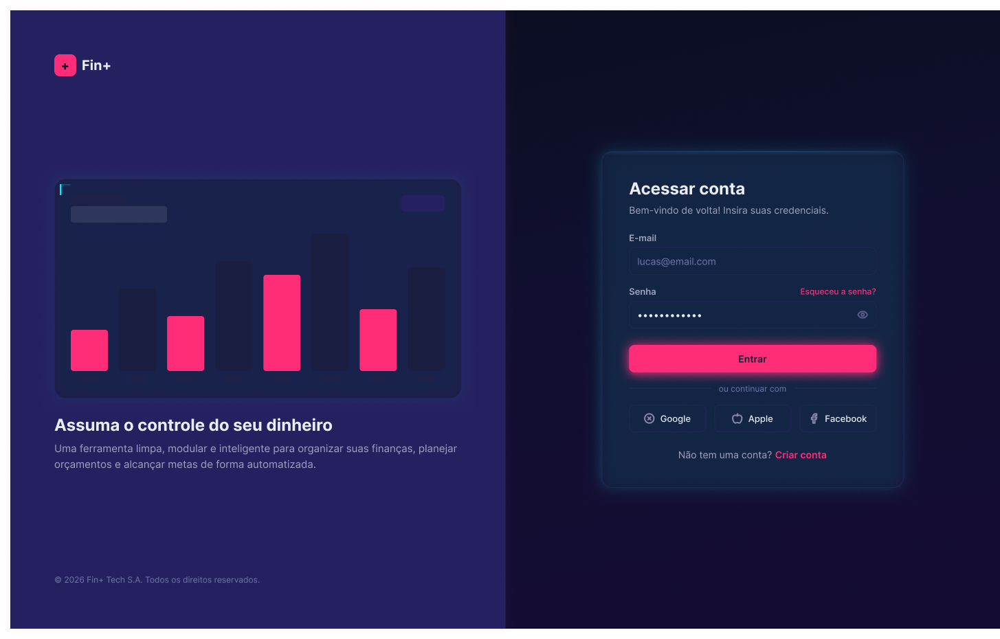

# 💰 Fin+

### Web app de acompanhamento financeiro pessoal



Fin+ conecta gastos reais do usuário às metas que ele define — fechando o ciclo
**registro → análise → ajuste de comportamento**, em vez de só categorizar despesas
como a maioria dos apps de finanças pessoais faz.

Este projeto também é meu processo de aprendizado prático de Next.js, TypeScript e
Supabase — o README documenta não só o que foi construído, mas **por que** cada
decisão de arquitetura foi tomada.

## Tecnologias

| Badge | Nome | Finalidade |
|---|---|---|
|  | **Next.js 16** | Framework React, App Router, Server Actions |
|  | **TypeScript** | Tipagem estática em todo o projeto |
|  | **Tailwind CSS v4** | Estilização utilitária |
|  | **shadcn/ui (Base UI)** | Componentes acessíveis, não estilizados por padrão |
|  | **Supabase** | Postgres + Auth + Row Level Security |
|  | **TanStack Query** | Cache e sincronização de dados assíncronos |
|  | **TanStack Table v9** | Motor de tabelas (Transações) |
|  | **TanStack Form** | Formulários, integrado a Zod |
|  | **Zod** | Validação de dados (cliente e servidor) |
|  | **Google Gemini API** | Insights financeiros personalizados por IA |
|  | **Vercel** | Deploy e hospedagem |

## Pré-requisitos

- Node.js 18 ou superior
- npm (instalado automaticamente com o Node.js)
- Uma conta no [Supabase](https://supabase.com) e no [Google AI Studio](https://aistudio.google.com) (chave da API Gemini)

## Decisões de arquitetura — o que e por quê

Esta seção existe porque, num projeto de aprendizado, entender o raciocínio por trás
de uma escolha vale tanto quanto o código em si.

**Base UI em vez de Radix como base do shadcn/ui.** Composição de componentes usa a
prop `render` (`<Trigger render={<Button />} />`), não `asChild` como no Radix;
`Select.Value` não resolve o rótulo do item selecionado automaticamente.

**Server Components como padrão; TanStack Query só onde a tela é interativa.**
Dashboard busca dados direto com `await` no servidor. TanStack Query entra em telas
que precisam de interatividade real (formulários, tabelas com busca/filtro local).

**RLS (Row Level Security) é a camada real de segurança — não o `proxy.ts`.** Toda
tabela do Supabase tem policies restringindo acesso via `auth.uid()`. O `proxy.ts`
só cuida do redirecionamento visual; o banco recusaria qualquer query sem o usuário
certo, mesmo que o proxy fosse contornado.

**Tabela de Transações reconstruída do zero, mais simples.** A primeira versão usava
um sistema de tabela (diceui/tablecn) pensado para cenários enterprise — paginação/
filtro no servidor, milhares de linhas. Foi fonte recorrente de bugs difíceis
(incompatibilidade de versão do Base UI, configuração de filtro pensada pro servidor
aplicada a dados carregados no cliente). Reconstruída com `@tanstack/react-table` v9
(API oficial mais recente do shadcn, com sistema de features "tree-shakeable") e
filtro/busca em memória via `useState` — adequado à escala real do problema (dezenas/
centenas de transações por usuário, não milhões).

**Ícones de categoria: mapa fixo, não `import *`.** `lucide-react` tem mais de 1.700
ícones; importar tudo de uma vez (`import * as Icons`) infla o bundle em ~1MB mesmo
usando só alguns. Solução: uma lista curada de ~40 ícones relevantes ao domínio,
importados nomeados (tree-shaking real, custo de bundle desprezível).

**Zod `.optional()` vs `z.union([z.string(), z.undefined()])`** num campo usado como
validador do TanStack Form. `.optional()` gera uma "chave opcional" (`campo?: string`);
o TanStack Form infere `defaultValues` como "chave sempre presente, valor pode ser
undefined" — tipos estruturalmente diferentes pro TypeScript. Corrigido com
`z.union([...])` sempre que o campo for usado como validador de formulário.

**Validação em duas camadas** em toda Server Action que recebe dado de formulário: Zod
no cliente (UX) e Zod de novo no servidor (segurança — alguém pode chamar a função
diretamente, pulando o formulário).

**Server Actions chamadas via `mutationFn`/`onClick` não usam `redirect()`
internamente**, nem são chamadas direto no corpo de um componente durante a
renderização — ver Troubleshooting.

**Domains do Postgres para valores monetários.** `positive_money_amount`
(`numeric(12,2)`, `CHECK (VALUE > 0)`) e `non_negative_money_amount` (`CHECK (VALUE >=
0)`, para valores que podem começar em zero).

**Insight de orçamento com IA (Gemini) e fallback baseado em regras.** A versão
baseada em regras sempre existe como *fallback* — `aiInsight || budgetInsight` na
exibição, então falha de rede/API cai de volta pra uma mensagem funcional.

**`type` (receita/despesa) fica salvo na própria transação**, mesmo sendo redundante
com o `type` da categoria escolhida — porque categoria pode ser apagada
(`ON DELETE SET NULL`), e o histórico financeiro não pode virar ambíguo por causa
disso. O formulário deriva `type` da categoria automaticamente; o campo nunca é
perguntado duas vezes ao usuário.

## Estrutura principal

```
app/
  (app)/                  # rotas autenticadas (sidebar compartilhada)
    dashboard/
    transactions/
    budgets/
  auth/                   # login, signup, callback OAuth
  layout.tsx
components/
  ui/                     # shadcn/ui (Base UI) — botões, dialogs, form, etc.
  transactions/           # tabela, dialog de criação/edição, ações
  budgets/                # cards, dialog, insight de IA
  sidebar/                # navegação principal
hooks/                    # use-transactions, use-budgets, use-categories (TanStack Query)
lib/
  actions/                # Server Actions (createTransaction, createBudget, etc.)
  schema/                 # validação Zod
  supabase/               # clients (browser/server)
  budgets.ts              # getBudgetPeriodRange (lógica pura, sem I/O)
```

## Rotas disponíveis

| Rota | Autenticação | Descrição |
|---|---|---|
| `/` | ❌ | Landing page |
| `/auth/login` | ❌ | Login (e-mail, Google, Facebook) |
| `/auth/signup` | ❌ | Cadastro |
| `/auth/callback` | ❌ | Callback do fluxo OAuth |
| `/dashboard` | ✅ | Resumo financeiro, gráfico de evolução |
| `/transactions` | ✅ | Listagem, criação, edição e exclusão de transações |
| `/budgets` | ✅ | Orçamentos por categoria + insight de IA |
| `/goals` | ⏳ | Metas de economia — ainda não implementada |
| `/reports` | ⏳ | Relatórios — ainda não implementada |
| `/categories` | ⏳ | Gerenciar categorias — ainda não implementada |

## Banco de dados (Supabase)

5 tabelas em `public`, todas com RLS habilitado: `profiles`, `categories` (com `icon`/
`color`, populadas via trigger no cadastro), `transactions`, `budgets` (limite
recorrente ou único por categoria), `goals` (metas de economia de longo prazo).

⚠️ **Furo de dado conhecido, ainda não corrigido**: `category_id` em `transactions` e
`budgets` usa `ON DELETE SET NULL`. Apagar uma categoria deixaria registros órfãos com
`category_id = null` batendo uns nos outros no cálculo de gasto por orçamento
(`null === null`). Precisa ser resolvido antes de construir a tela de gerenciar
categorias.

## Funcionalidades implementadas

- [x] Cadastro, login (e-mail + Google + Facebook), logout
- [x] Layout com sidebar persistente, navegação real, breadcrumb dinâmico
- [x] Dashboard com dados reais
- [x] Transações: listagem, busca, criação, edição e exclusão, validação em duas
      camadas, `type` derivado automaticamente da categoria
- [x] Orçamentos: recorrentes ou únicos, cards com progresso e cores por status,
      insight gerado por IA com fallback baseado em regras, CRUD completo
- [ ] Metas de economia de longo prazo
- [ ] Tela de gerenciar categorias — bloqueada até resolver o furo de dado acima
- [ ] Relatórios e gráficos analíticos
- [ ] SMTP próprio (Resend/SendGrid/Postmark) — antes do lançamento
- [ ] Botão de login com Apple removido dos wireframes/telas (pendente)

## Configuração do Supabase (passo a passo)

### 1) Criar o projeto e rodar o schema

1. Acesse [app.supabase.com](https://app.supabase.com) e crie um projeto novo.
2. Abra `SQL Editor`, copia o conteúdo de [`schema.sql`](./schema.sql) (na raiz do
   repositório) e cola lá. Clica em **RUN**.
3. Confira em `Table Editor` se `profiles`, `categories`, `transactions`, `budgets` e
   `goals` foram criadas, todas com o cadeado de RLS habilitado.

### 2) Configurar autenticação

1. Em `Authentication → Providers`, ative **Google** e **Facebook** com as
   credenciais dos respectivos consoles de desenvolvedor.
2. Em `Authentication → URL Configuration`, adiciona `http://localhost:3000/**` (e o
   domínio de produção) em **Redirect URLs**.
3. Durante o desenvolvimento, considere desativar "Confirm email" (`Authentication →
   Providers → Email`) — o serviço de e-mail embutido do Supabase tem limite de 3
   e-mails/hora.

### 3) Variáveis de ambiente

Cria um `.env.local` na raiz:

```
NEXT_PUBLIC_SUPABASE_URL=
NEXT_PUBLIC_SUPABASE_PUBLISHABLE_KEY=
NEXT_PUBLIC_SITE_URL=http://localhost:3000
GEMINI_API_KEY=
```

## Como executar

```bash
npm install
npm run dev
```

Abre [http://localhost:3000](http://localhost:3000).

```bash
npm run build    # build de produção
npm run start    # roda a build localmente
```

## ❓ Troubleshooting

Problemas reais encontrados construindo o projeto, e como foram resolvidos —
guardados aqui porque é bem provável que se repitam.

### "NEXT_REDIRECT" aparece como mensagem de erro pro usuário

**Causa**: `redirect()` do Next.js só é interceptado corretamente quando a Server
Action é chamada via `<form action={...}>`. Chamada de outra forma (dentro de
`mutationFn` do TanStack Query, ou via `onClick`), o redirecionamento "vaza" como uma
exceção visível.

**Solução**: remove o `redirect()` de dentro da Server Action; faz a navegação de
sucesso no cliente, com `useRouter().push(...)` dentro do `onSuccess` da mutation.

### "Cannot update a component while rendering a different component"

**Causa**: uma Server Action (inclusive uma que chama uma IA externa) sendo chamada
direto no corpo de um componente, durante a renderização — em vez de dentro de um
`useQuery`/`useMutation`.

**Solução**: qualquer chamada assíncrona com efeito colateral precisa passar por
`useQuery` (leitura) ou `useMutation` (escrita), nunca ser invocada direto no render.

### Build falha na Vercel com erros de tipo do Base UI, mas funciona local

**Causa**: dependência de uma versão do `@base-ui/react` diferente da que o código
(ou uma biblioteca de terceiros, como um bloco de tabela) foi escrito para —
biblioteca ainda muito ativa em mudanças de API entre versões.

**Solução**: compara o commit realmente deployado na Vercel com o local (`git log -1
--stat` nos dois); geralmente é uma alteração não commitada/pushada, não a
biblioteca em si. Se for mesmo incompatibilidade de versão, os próprios erros de
TypeScript mostram o formato novo esperado.

### Login com Google funciona no `localhost` mas redireciona pra produção (ou vice-versa)

**Causa**: a **Site URL** do Supabase (`Authentication → URL Configuration`) é usada
como destino padrão sempre que o `redirectTo` enviado pelo código não bate
**exatamente** com uma entrada da lista de **Redirect URLs** — incluindo barra final
duplicada/faltando.

**Solução**: adiciona `http://localhost:3000/**` e o domínio de produção com `/**`
na lista de Redirect URLs; garante que a variável `NEXT_PUBLIC_SITE_URL` (usada pra
montar o `redirectTo`) não tem barra duplicada.

### Loop infinito de reconexão do HMR (`npm run dev`)

Investigado extensivamente sem causa raiz 100% confirmada — candidatos descartados:
OneDrive sincronizando a pasta do projeto, Windows Defender escaneando `node_modules`
em tempo real, Turbopack. Parecia ligado a estado de sessão/autenticação em páginas
públicas. Se enfrentar isso: teste rodar sem Turbopack (`npx next dev`), exclua a
pasta do projeto do antivírus, e confirme que não há duas instâncias de
`npm run dev` rodando ao mesmo tempo.

## 👨‍💻 Desenvolvedor

- [Linconl Augusto](https://github.com/LinconlBR) — desenvolvimento, arquitetura e
  design

## 📝 Licença

Projeto pessoal de aprendizado/portfólio, disponível sob a MIT License.